# Report and Analysis

## RESTest Tests

In the paper, ["RESTest: Automated Black-Box Testing of RESTful Web APIs"](https://personal.us.es/amarlop/wp-content/uploads/2021/06/RESTest-Automated-Black-Box-Testing-of-RESTful-Web-APIs.pdf), the RESTest application is run against three different API's. For each API only one specific endpoint is tested, with both random testing and constraint based testing. In this section we will be rerunning these tests to verify the results found in the paper above.

## Recreating Tests

### Stripe: Create Product

#### Random Testing

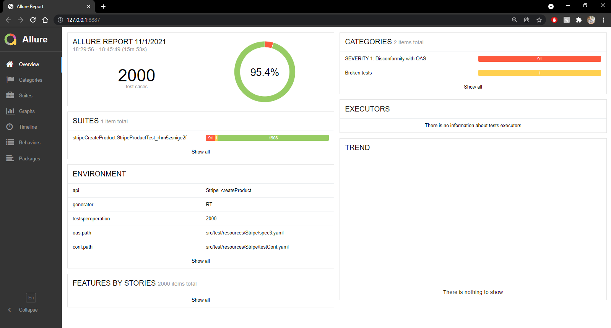
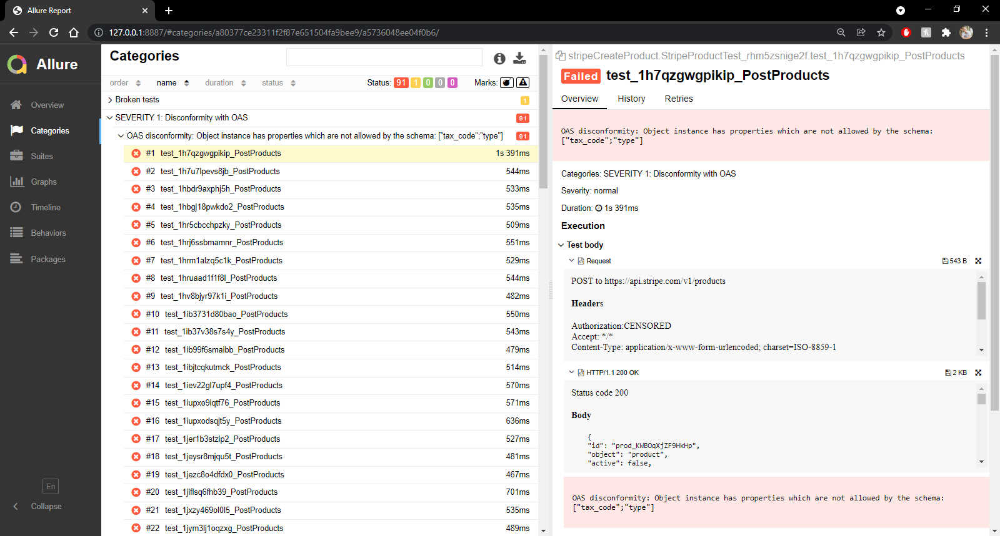

#### Constraint Based Testing

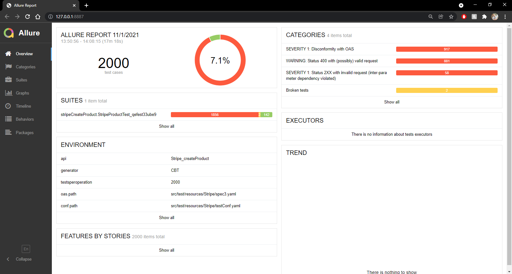
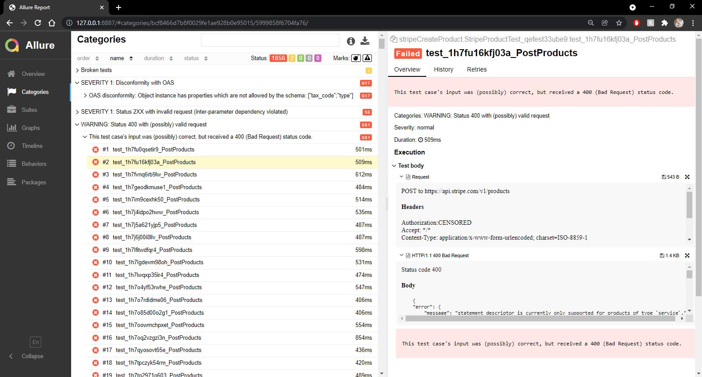

#### Examination

|          | RT Pass | RT Fail | RT Pass Rate | CBT Pass | CBT Fail | CBT Pass Rate |
| -------- | ------- | ------- | ------------ | -------- | -------- | ------------- |
| Reported | 2000    | 0       | 100%         | 1465     | 535      | 73%           |
| Observed | 1908    | 92      | 95%          | 144      | 1856     | 7%            |

When observing random based testing with the create product endpoint for the Stripe API it was originally observed that there were no errors present. When run locally the results aligned well, however a small number of errors were found. The majority of these were "OAS disconformity" errors. RESTest attempts to probe a 4XX error result from API's, it does this be sending information that does not align with the OAS form. In this case two extra fields were sent with random data, these being "tax_code" and "type". The API in question simply ignored the extra data and returned a "200 OK" response. 

Constraint based testing yielded similar results to random testing in terms of "OAS disconformity", however several 4XX errors were reported because of faulty parameters. These are not erroring so much as warnings, notifying the user that the data they are sending to the API does not fit the designated constraints of the database.

```
{
    "error": {
        "message": "statement_descriptor is currently only supported for products of type `service`.",
        "param": "statement_descriptor",
        "type": "invalid_request_error"
    }
}
```

This is an example of the body of the response for these warnings. It explains that "statement_descriptor" is a dependent variable, that can only be used for products of type "service".

### Yelp: Search Businesses

#### Random Testing

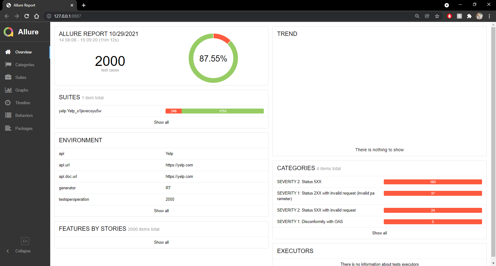
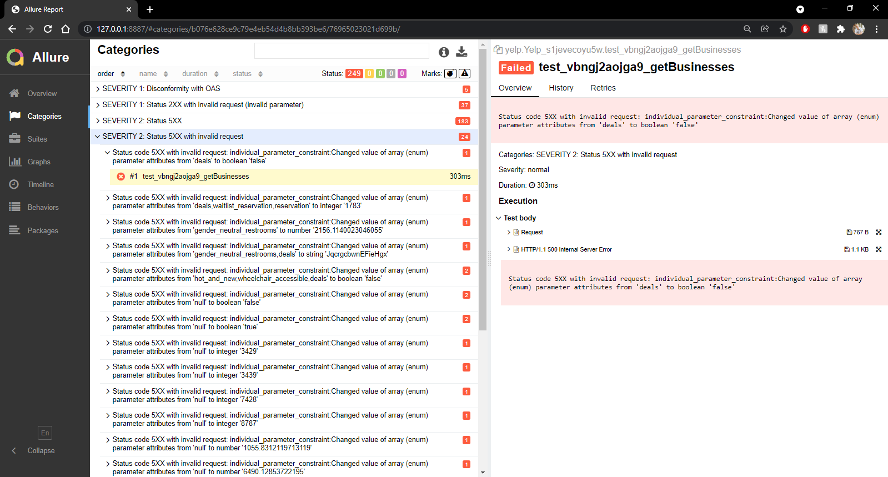

#### Constraint Based Testing

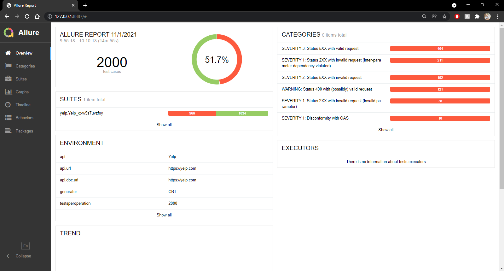
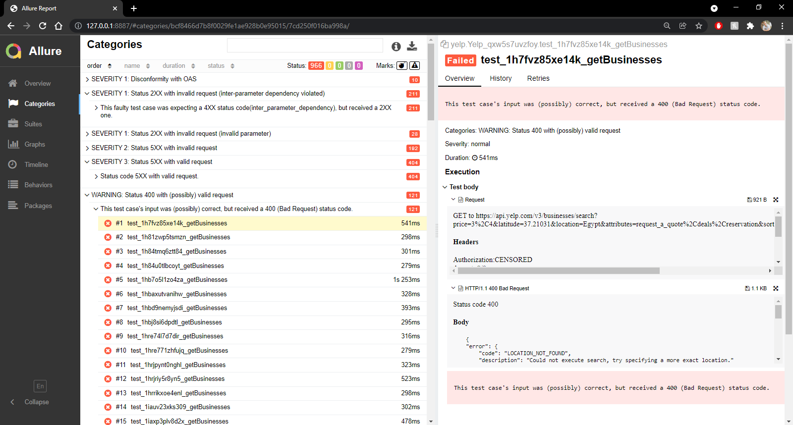

#### Examination

|          | RT Pass | RT Fail | RT Pass Rate | CBT Pass | CBT Fail | CBT Pass Rate |
| -------- | ------- | ------- | ------------ | -------- | -------- | ------------- |
| Reported | 1933    | 67      | 97%          | 1839     | 161      | 92%           |
| Observed | 1751    | 249     | 88%          | 1034     | 966      | 52%           |

In testing random data against the search business endpoint in the Yelp API a similar set of errors were seen. There were four primary categories of errors captured.

Disconformity with OAS (5 recorded errors)
- Like the explanation above these are a result of extra data being passed in. RESTest expects the API to return an error, but instead received a "200 OK" response.

Status 2XX with invalid request (invalid parameter) (37 recorded errors)
- These are a result of the API not sending a 4XX error when given data of the wrong type. This means if the API is expecting a list of items, but instead receives a Boolean value, it is not erroring out as expected. It is instead returning a "200 OK" response, however it is worthwhile to note that all "200 OK" response contain no data as shown below.

```
{
    "businesses": [
        
    ],
    "total": 0,
    "region": {
        "center": {
            "longitude": -106.44927978515625,
            "latitude": 31.653215982221013
        }
    }
}
```

Status 5XX (183 recorded errors)
- These appear to be internal errors within the Yelp API. When the request is made the response that is given is as follows.

```
{
    "error": {
        "code": "INTERNAL_ERROR",
        "description": "Something went wrong internally, please try again later."
    }
}
```

Status 5XX with invalid request (24 recorded errors)
- Like the previous case, but these contain data that is not expected by the API.

For constraint based testing the number of errors rose dramatically compared to the reported results. The errors experienced are like that of the random testing. With a noted rise in "Status 5XX with invalid request", "Status 5XX with valid request", and "Status 2XX with invalid request".

### Youtube: Search

#### Random Testing

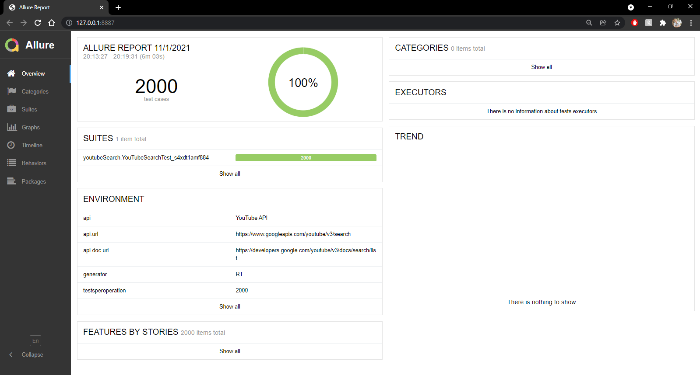

#### Constraint Based Testing

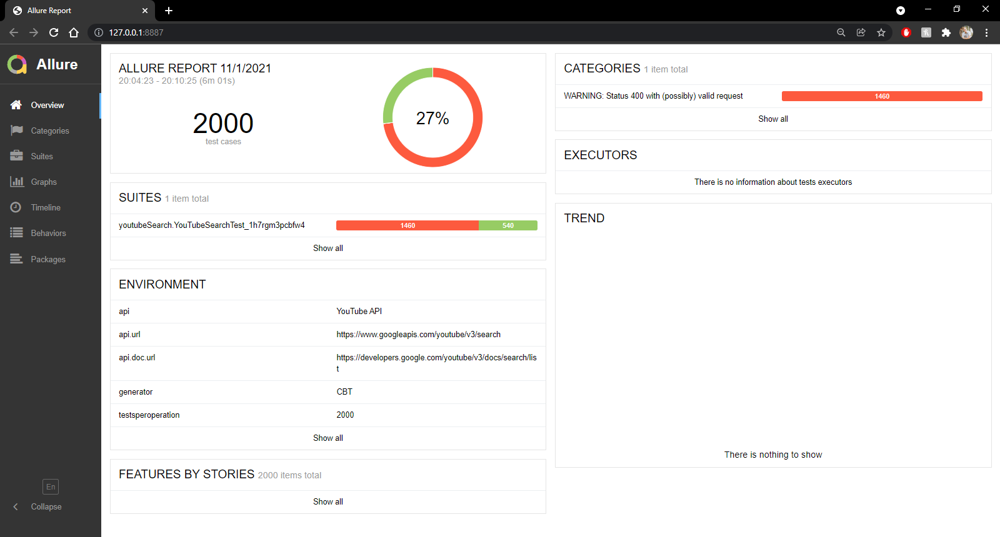
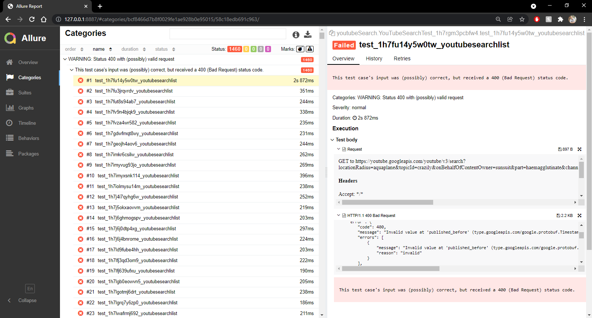

#### Examination

|          | RT Pass | RT Fail | RT Pass Rate | CBT Pass | CBT Fail | CBT Pass Rate |
| -------- | ------- | ------- | ------------ | -------- | -------- | ------------- |
| Reported | 2000    | 0       | 100%         | 1487     | 513      | 74%           |
| Observed | 2000    | 0       | 100%         | 540      | 1460     | 27%           |

It can be seen that random testing reported and observed results aligned exactly. However, these tests are of no value. The data being generated by RESTest does not align with Youtube's API at all. The requests being made are all being denied due to invalid data. RESTest is recognizing these as passing requests when they are not.

Constraint based testing is actually picking up on these bad requests and reporting them as warnings under the code "Status 400 with (possibly) valid requests". The error follows the one below, they are failing to generate a valid "published_before" by Youtube's standards, but RESTest sees the parameter as "possibly" correct.

```
{
    "error": {
        "code": 400,
        "message": "Invalid value at 'published_before' (type.googleapis.com/google.protobuf.Timestamp), Field 'published_before', Illegal timestamp format; timestamps must end with 'Z' or have a valid timezone offset.",
        "errors": [
            {
                "message": "Invalid value at 'published_before' (type.googleapis.com/google.protobuf.Timestamp), Field 'published_before', Illegal timestamp format; timestamps must end with 'Z' or have a valid timezone offset.",
                "reason": "invalid"
            }
        ],
        "status": "INVALID_ARGUMENT"
    }
}
```

## New Tests

### OMDb: Search

#### Random Testing

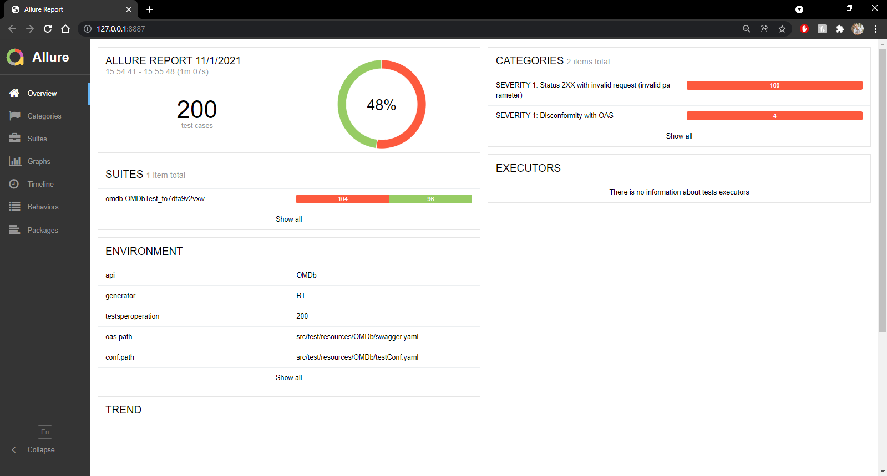
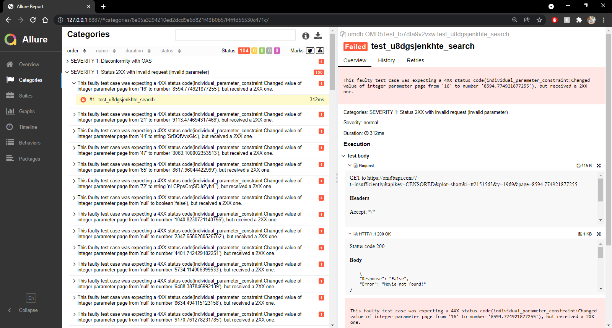

#### Constraint Based Testing

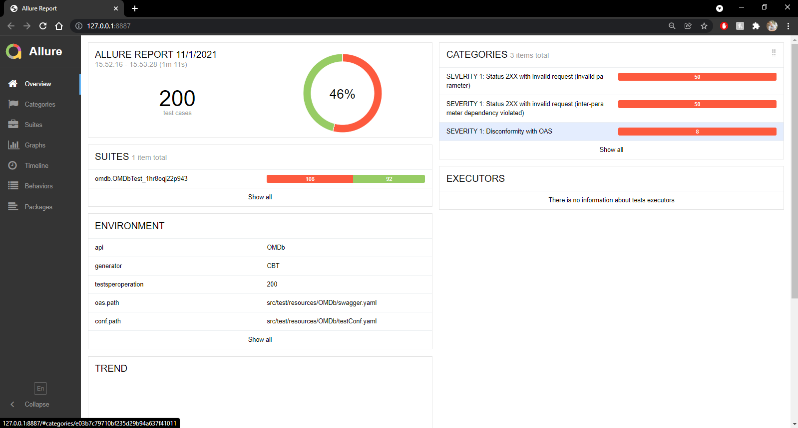
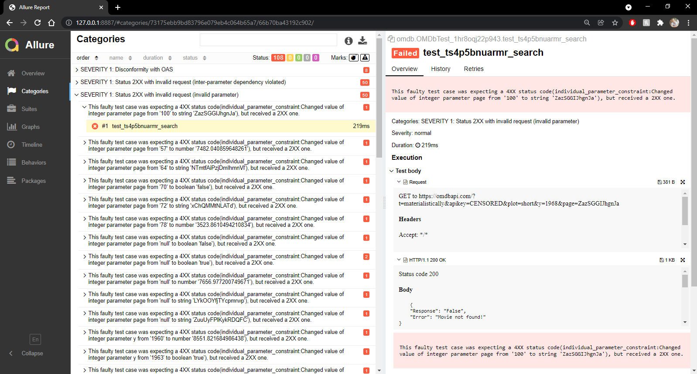

#### Examination

|          | RT Pass | RT Fail | RT Pass Rate | CBT Pass | CBT Fail | CBT Pass Rate |
| -------- | ------- | ------- | ------------ | -------- | -------- | ------------- |
| Observed | 96      | 104     | 48%          | 92       | 108      | 46%           |

In testing OMDb, a quota was in place limiting the number of calls that can be made consecutively, for that reason each test consists of only 200 test cases.

In examining the random testing two types of errors were seen "Disconformity with OAS" and "Status 2XX with invalid request (invalid parameter)". Refer above for explanation of error meaning. 

Constraint based testing returned similar results with the addition of "Statues 2XX with invalid request (inter-parameter dependency violation)". Within an OAS file dependency can be outlined for variables, certain variable values can depend on other variables. RESTest can use these to create data aimed to align and misalign with these dependencies. This error reports that when RESTest believe it has broken one of these rules the API is still returning "200 OK".

### Foursquare: Search Venus

#### Random Testing

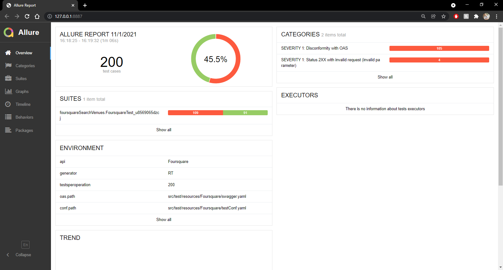
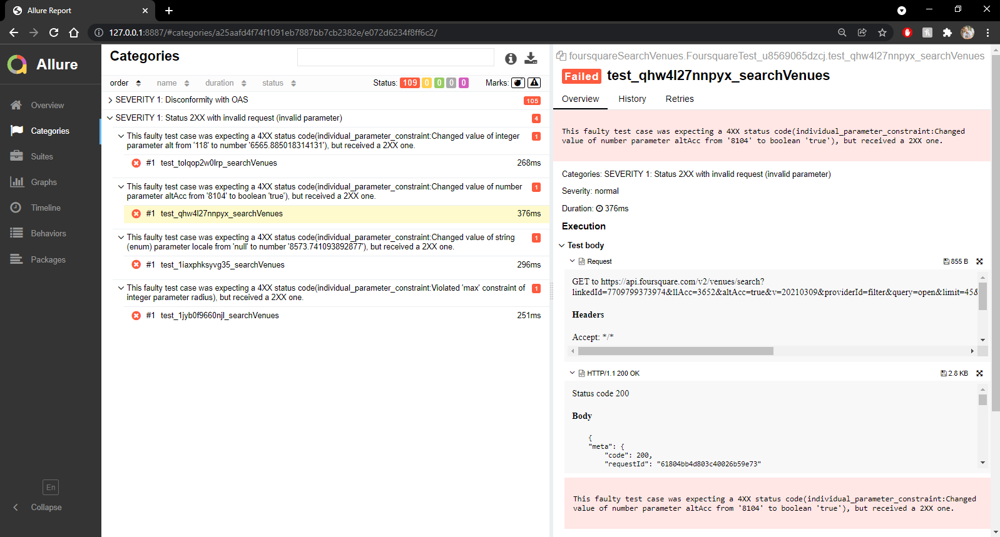

#### Constraint Based Testing

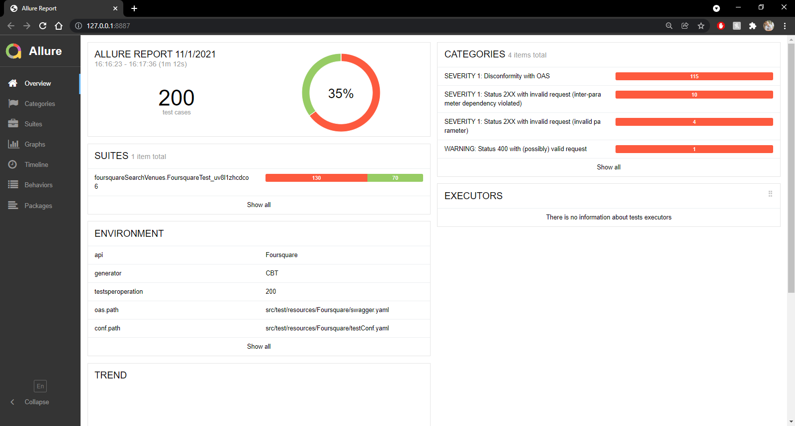
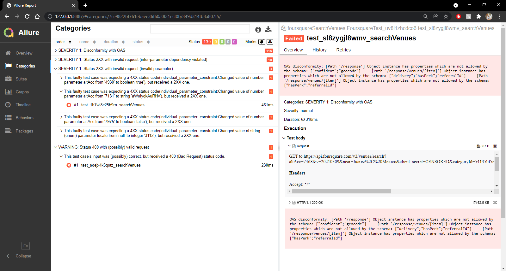

#### Examination

|          | RT Pass | RT Fail | RT Pass Rate | CBT Pass | CBT Fail | CBT Pass Rate |
| -------- | ------- | ------- | ------------ | -------- | -------- | ------------- |
| Observed | 91      | 109     | 46%          | 70       | 130      | 35%           |

In testing Foursquare, a quota was in place limiting the number of calls that can be made consecutively, for that reason each test consists of only 200 test cases.

In examining the random testing and constraint based testing two types of errors were seen "Disconformity with OAS" and "Status 2XX with invalid request (invalid parameter)". Refer above for explanation of error meaning. 

## Conclusion

In reviewing the recreation of tests as reported by the paper ["RESTest: Automated Black-Box Testing of RESTful Web APIs"](https://personal.us.es/amarlop/wp-content/uploads/2021/06/RESTest-Automated-Black-Box-Testing-of-RESTful-Web-APIs.pdf), relatively similar results can be seen. The validity of the tests and responses can however be called into question regarding their usefulness. Specifically with random testing of Youtube's API, the results were invalid and meaningless. This also shows the extent of random testing against complex API's, with many dependencies and rules. Many of the constraint based tests returned valuable information that can be used to improve API's. 

Despite the difference in results in can be seen that the tool RESTest is viable and useful based on the results provided in the paper above. Note also the time difference between the tests, in this time the APIs could have been updated and redesigned internally. This conclusion is supported by the API's that were tested that were not within the paper. OMDb and Foursquare's tests both revealed information that can be used to build and more secure and consistent API.